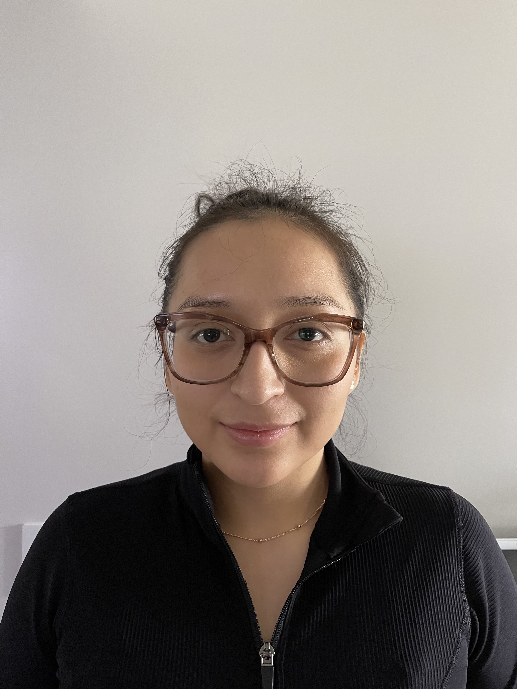

# Web-Development-In-Class

I am currently studying Computer Science and my goal is to become a Web Developer. I have taken courses in Java, Operating Systems, and Software Engineering. In the Software Engineering course, I worked in a group to create a website called "The Shoe Store" using technologies such as HTML, PHP, SQL, and CSS. This class was challenging for me as it was my first time using PHP, but I enjoyed it as it allowed me to learn how to create a website from scratch.

In the upcoming class, I am excited to learn about mobile-first web app development and to use the Angular framework. I am also looking forward to learning about full stack development using NodeJS and Vue. While this class will be challenging for me as it involves learning new technologies, I am excited to expand my knowledge and skills.

When I started my studies at SUNY New Paltz, it was difficult as I am also a mother. To manage my studies and motherhood, I decided to take only two courses per semester. This has been challenging, but I am determined to succeed.
